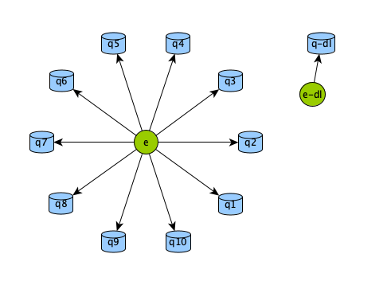

# bunnyplot 
A utility for producting GraphML graphs and other visualizations of RabbitMQ



## Usage
```
% bunnyplot --help
Usage: bunnyplot [OPTIONS] URL OUTPUT_PATH

Options:
  -u, --username TEXT
  -p, --password TEXT
  --help               Show this message and exit.
```

### Usage with yEd
By default, yEd will not recognize node labels or properties. These must be mapped using the Properties Mapper(`Edit > Properties Mapper...`).

bunnyplot provides a preset for mapping properties. [bunnyplot.cnfx](bunnyplot.cnfx). Import this to your properties mapper and apply the changes. You should see the nodes change size, shape and colour. 

You may also need to rearrange them into a better layout. Use the `Layout` menu to select a type e.g. `Organic` and apply. 


## Development

This project uses pipenv to manage it's **development** environment.

Development dependencies should be specified in `setup.py`. Package dependencies should not change in the Pipfile. 

Code should be formatted with `black`. Use the pipenv script `format-check` and `format` to check and format code, respectively.

